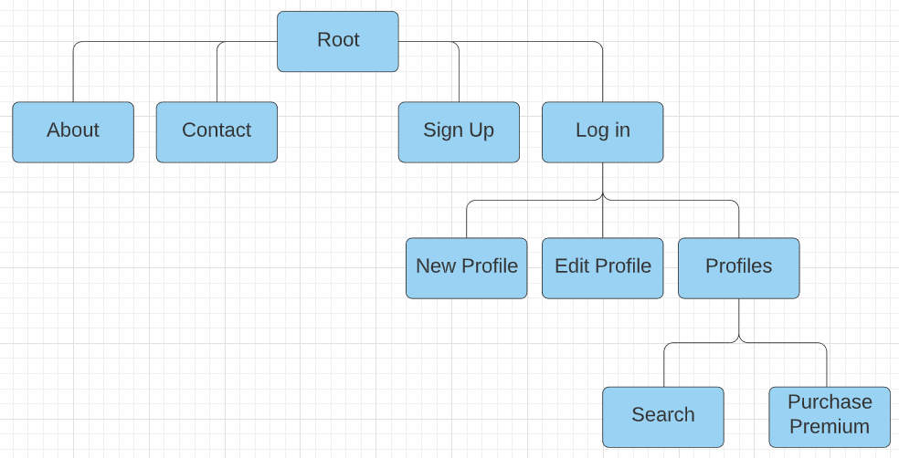
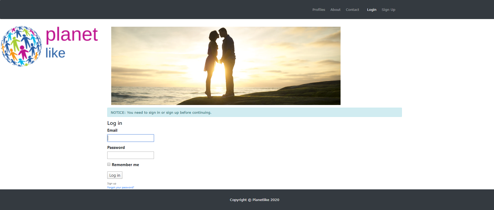
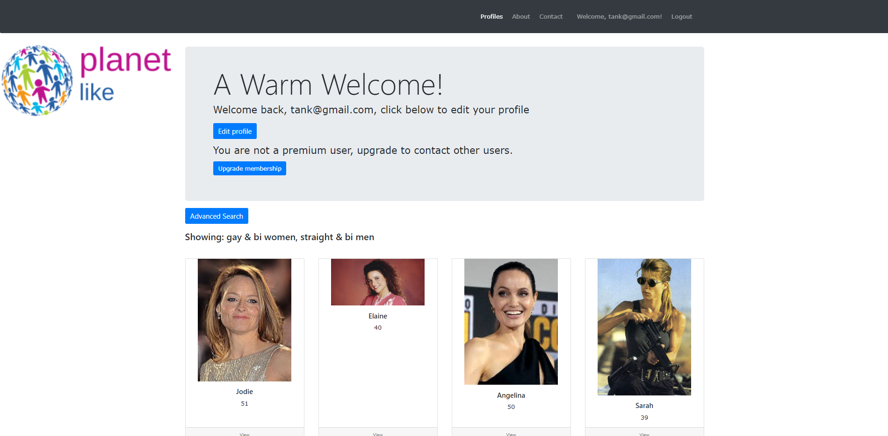
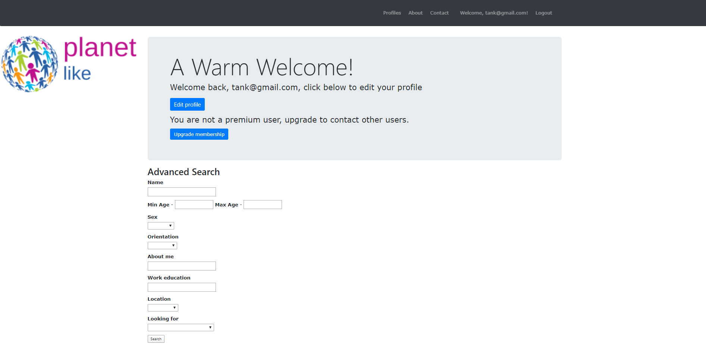
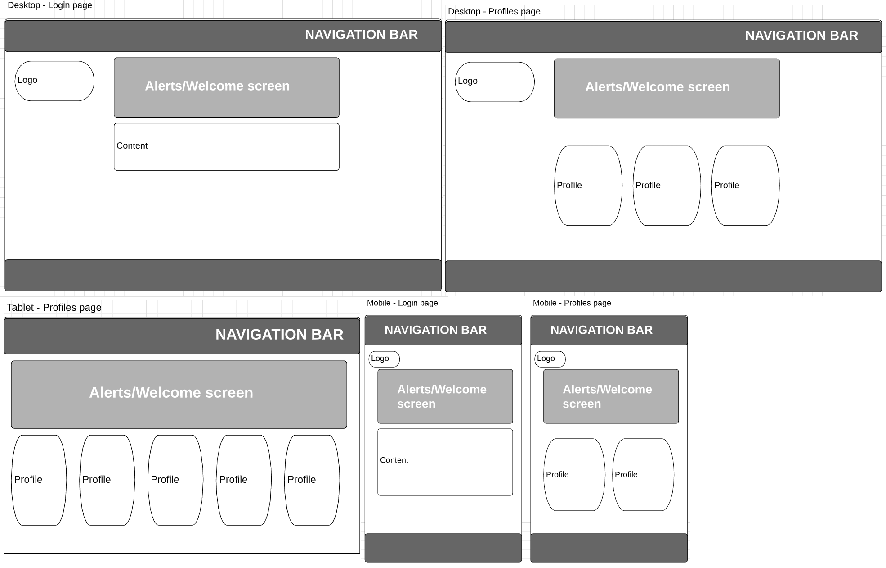
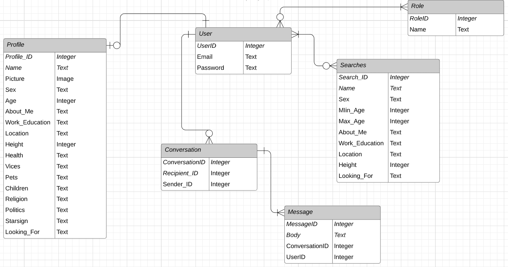
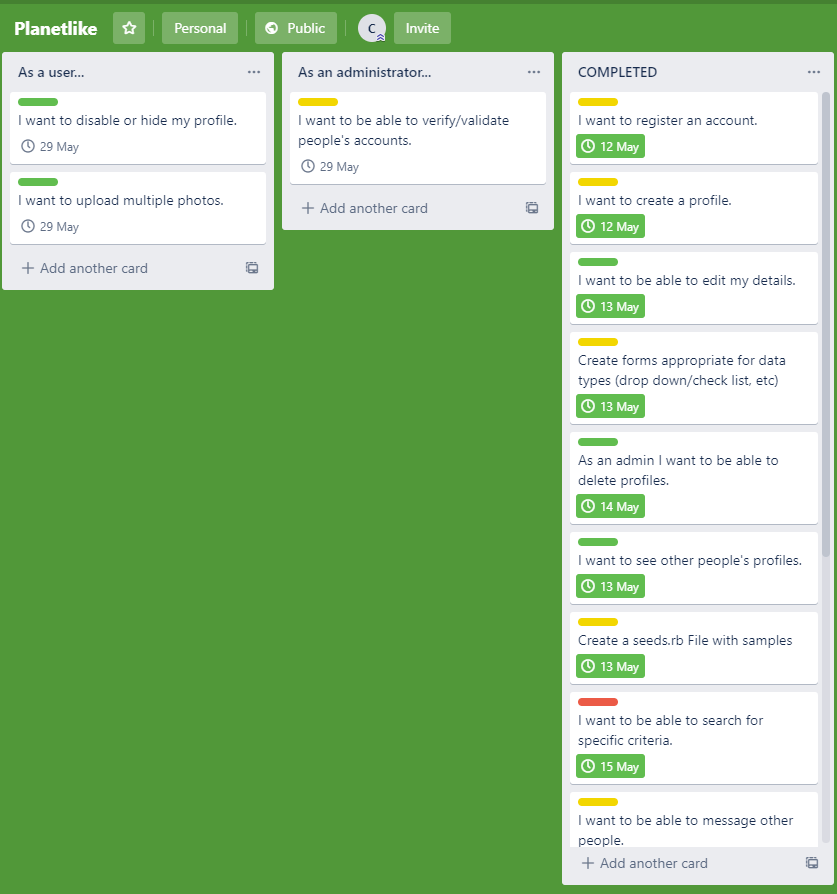

# README

### R7	Identification of the problem you are trying to solve by building this particular marketplace app.
This app seeks to solve the problem of not having a dedicated dating app for global-scale connections and relationships.  Tinder, Bumble, plentyoffish, okcupid, etc, all are focussed primarily on finding someone close to you.  Planetlike was built from the bottom-up with the intention of blurring the lines between locales.  The aim is to make the world feel smaller.

### R8	Why is it a problem that needs solving?
In this high-tech time, the world is very small.  We are more connected than ever, and so we no longer need to limit our relationship criteria to someone who is within 50km's of our location.  Travel is cheap and remote work is on the up and up, so this app is filling a growing need in the market.

### R9	A link (URL) to your deployed app (i.e. website)
  [Planetlike website](https://planetlike.herokuapp.com/)

### R10	A link to your GitHub repository (repo).
  [Planetlike Github repo](https://github.com/Radicals27/planetlike)

### R11	Description of your marketplace app (website), including:
- Purpose: To connect people from all around the world with each other,maximising the chances of finding a highly-compatible partner.
- Functionality / features: User registration, profile browsing according to gender and orientation, advanced search feature, premium membership that allows user to user communication.
- Sitemap: 


- Screenshots: 







- Target audience: Anyone over the age of 18 looking for anything from a penpal, friend to a serious relationship.
- Tech stack: The application uses Ruby on Rails 6, HTML5, CSS3, and is deployed in heroku (www.heroku.com)

### R12	User stories for your app
* As a user I want to be register an account
* As a user I want to be able to create a profile
* As a user I want to be able to edit my details/profile
* As a user I want to be able to search for specific criteria
* As a user I want to be able to see other people's profiles
* As a user I want to be able to message other users
* As a user I want to be able to become a premium user

### R13	Wireframes for your app


### R14	An ERD for your app


### R15	Explain the different high-level components (abstractions) in your app
* The application was constructed following a Model-View-Controller methodology. They can be broken down as follows:

#### Conversation:
The conversation model handles the connecting of a recipient and a sender with a conversation ID in a joining table.  The conversation view displays all of the user's that the current user has previously messaged or who they have received messages from.  Finally, the conversation controller handles the validation of the current user's premium membership, prior to allowing them to use the messaging feature.  As well as this it controls the parameters passed to the conversation view as well as the actual creation of the conversation in the database.
    
####  Message:
The message model handles the indiovidual messages sent between 2 users within a conversation.  It's view is a partial which displays all previous messages in said conversation.  The controller handles appending new messages to the established conversation.

####  Profile:
The profile model organises the descriptive data for a person's profile such as age, sex, height and location.  It's view displays either all profiles applicable to the current user (based on sex and orientation) or displays an individual profile.  The profile controller handles creation and editing of profiles as well as setting of various gender/orientation-based instance variables for the associated view.

####  User:
The user model is created by the Devise Gem and handles creation, editing and destroying of users.  A user must be setup before being able to view the core site.  The user view displays all users, and the controller is handled by Devise and is left unchanged for this application.

####  Role:
The role model is created by the Rolify Gem, it's model and controller are left unchanged for this app.  Only one role was created - admin, which allows the bearer to destroy profiles (default users cannot delete profiles).  Also the admin can see all profiles and is not limited by gender/orientation criteria.

####  Search:
The search model stores all searches carried out by users, and holds the criteria used in said search.  The search view displays search criteria in the form of drop down boxes and text fields, and once they have been submitted, the results are shown as a list of user profiles that match the criteria (if any).  The controller uses the LIKE and ILIKE functionality of rails/SQL to find similar matches to all criteria.


### R16	Detail any third party services that your app will use
The app utilises Stripe's payment handling system (www.stripe.com) incorporated as a Gem in the Gemfile.
Images are stored by implementing Cloudinary & Active Storage, using the API and assosciated Gem.
It also utilises Bootstrap, incorporated as a Gem in the Gemfile.

### R17	Describe your projects models in terms of the relationships (active record associations) they have with each other
* User **has one** profile. Limits 1 profile per user.
* Profile **belongs to** User. Links a profile to a user.
* Conversation **belongs to** sender and recipient. So both the sender and recipient can view the conversation.
* Message **belongs to** conversation and user. A *user* has the authority to view messages and *conversation* can reference all the messages inside it.
* Role **has and belongs to many** Users.  Many users can have a given role, and any role always belongs to Users.

### R18	Discuss the database relations to be implemented in your application
* **Users** table - Contains no foreign keys and is the root table for all other tables.
* **Profiles** table - Contains a foreign key 'user_id' to connect it to a given user from the users table
* **Conversations** table - Contains both a 'senders_id' and 'recipient_id' which refer to user_id's from the 'Users' table.
* **Messages** table - Contains a 'user_id' referencing the user (from the 'Users' table) who wrote the message.
* **Users_Roles** table is a joining table connecting a given user_id from the 'Users' table with a given role_id from the 'Roles' table.


### R19	Provide your database schema design
```
create_table "active_storage_attachments", force: :cascade do |t|
    t.string "name", null: false
    t.string "record_type", null: false
    t.bigint "record_id", null: false
    t.bigint "blob_id", null: false
    t.datetime "created_at", null: false
    t.index ["blob_id"], name: "index_active_storage_attachments_on_blob_id"
    t.index ["record_type", "record_id", "name", "blob_id"], name: "index_active_storage_attachments_uniqueness", unique: true
  end

  create_table "active_storage_blobs", force: :cascade do |t|
    t.string "key", null: false
    t.string "filename", null: false
    t.string "content_type"
    t.text "metadata"
    t.bigint "byte_size", null: false
    t.string "checksum", null: false
    t.datetime "created_at", null: false
    t.index ["key"], name: "index_active_storage_blobs_on_key", unique: true
  end

  create_table "conversations", force: :cascade do |t|
    t.integer "sender_id"
    t.integer "recipient_id"
    t.datetime "created_at", precision: 6, null: false
    t.datetime "updated_at", precision: 6, null: false
  end

  create_table "messages", force: :cascade do |t|
    t.text "body"
    t.bigint "conversation_id"
    t.bigint "user_id"
    t.datetime "created_at", precision: 6, null: false
    t.datetime "updated_at", precision: 6, null: false
    t.index ["conversation_id"], name: "index_messages_on_conversation_id"
    t.index ["user_id"], name: "index_messages_on_user_id"
  end

  create_table "orders", force: :cascade do |t|
    t.integer "product_id"
    t.integer "user_id"
    t.integer "status", default: 0
    t.string "token"
    t.string "charge_id"
    t.string "error_message"
    t.string "customer_id"
    t.integer "payment_gateway"
    t.datetime "created_at", precision: 6, null: false
    t.datetime "updated_at", precision: 6, null: false
    t.integer "price_cents", default: 0, null: false
  end

  create_table "products", force: :cascade do |t|
    t.string "name"
    t.string "stripe_plan_name"
    t.string "paypal_plan_name"
    t.integer "price_cents", default: 0, null: false
    t.string "price_currency", default: "USD", null: false
  end

  create_table "profiles", force: :cascade do |t|
    t.string "name"
    t.string "sex"
    t.integer "age"
    t.string "about_me"
    t.string "work_education"
    t.string "location"
    t.string "height"
    t.string "health"
    t.string "vices"
    t.string "pets"
    t.string "children"
    t.string "religion"
    t.string "politics"
    t.string "starsign"
    t.string "looking_for"
    t.datetime "created_at", precision: 6, null: false
    t.datetime "updated_at", precision: 6, null: false
    t.string "orientation"
    t.bigint "user_id"
    t.index ["user_id"], name: "index_profiles_on_user_id"
  end

  create_table "roles", force: :cascade do |t|
    t.string "name"
    t.string "resource_type"
    t.bigint "resource_id"
    t.datetime "created_at", precision: 6, null: false
    t.datetime "updated_at", precision: 6, null: false
    t.index ["name", "resource_type", "resource_id"], name: "index_roles_on_name_and_resource_type_and_resource_id"
    t.index ["resource_type", "resource_id"], name: "index_roles_on_resource_type_and_resource_id"
  end

  create_table "searches", force: :cascade do |t|
    t.string "name"
    t.integer "min_age"
    t.integer "max_age"
    t.string "sex"
    t.string "orientation"
    t.string "about_me"
    t.string "work_education"
    t.integer "height"
    t.string "location"
    t.string "looking_for"
    t.datetime "created_at", precision: 6, null: false
    t.datetime "updated_at", precision: 6, null: false
  end

  create_table "users", force: :cascade do |t|
    t.string "email", default: "", null: false
    t.string "encrypted_password", default: "", null: false
    t.string "reset_password_token"
    t.datetime "reset_password_sent_at"
    t.datetime "remember_created_at"
    t.datetime "created_at", precision: 6, null: false
    t.datetime "updated_at", precision: 6, null: false
    t.boolean "subscribed"
    t.string "stripeid"
    t.index ["email"], name: "index_users_on_email", unique: true
    t.index ["reset_password_token"], name: "index_users_on_reset_password_token", unique: true
  end

  create_table "users_roles", id: false, force: :cascade do |t|
    t.bigint "user_id"
    t.bigint "role_id"
    t.index ["role_id"], name: "index_users_roles_on_role_id"
    t.index ["user_id", "role_id"], name: "index_users_roles_on_user_id_and_role_id"
    t.index ["user_id"], name: "index_users_roles_on_user_id"
  end

  add_foreign_key "active_storage_attachments", "active_storage_blobs", column: "blob_id"
  add_foreign_key "profiles", "users"
```

### R20	Describe the way tasks are allocated and tracked in your project

As the project was created by 1 person, all tasks were allocated to the developer.  The schedule of tasks was managed by creating an MVP design in Trello.


[Trello Board](https://trello.com/b/fY9a3x8Z/planetlike)

Tasks were firstly sorted into "small", "medium" and "large" tasks based on estimated completion complexity & time. Each day, 1 "large" task would be attempted, with smaller and medium tasks being attempted if there was still time.

As tasks were completed they were dragged to the "Completed" column.  By 1 week in, the MVP was completed, allowing some extra features to be worked on such as increased search criteria and styling.